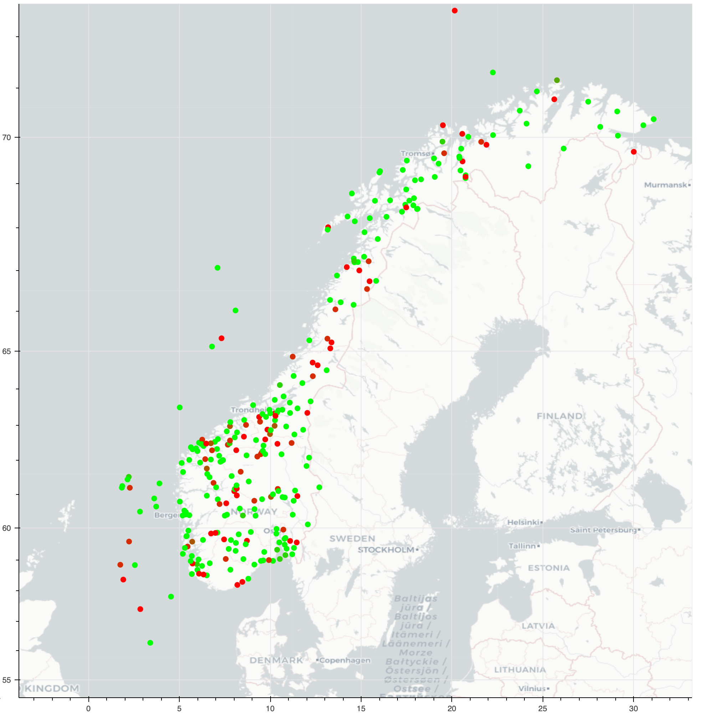

# Machine learning for wind prediction and modelling

This repository contains code for wind data collection, processing and analysis.

Sources of data:

* [https://seklima.met.no/](https://seklima.met.no/) , 
	* API: [https://frost.met.no/](https://frost.met.no/)
* [https://surfobs.climate.copernicus.eu/](https://surfobs.climate.copernicus.eu/)

*Figure displays number of stations from seklima that measures the wind at a 10 minute interval. The color is according to the stations quality code. from worst to best (red - green).*

## Description of the work packages

**WP1**: Analysis of a sensor network recording weather data over Norway. 

The goal of the WP1 is to analyze weather data collected all over Norway by a network of sensors. We seek to understand the behavior of weather variables, in particular the wind and their correlation in different place of Norway. Network science and machine learning methods will be used to find interesting places for the implantation of future windmills.

**WP2**: Offshore wind data from measurements and meteorological models

The goal of the WP2 is to identify and collect weather data related to offshore wind along the Norwegian coast. The student will download and categorize the available data, prepare python scripts for initial statistical analysis of the data, as well as scripts for presentation of meteorological data and results of analysis. 
Title: Offshore wind data from measurements and meteorological models
Description: The goal of the project is to identify and collect weather data related to offshore wind along the Norwegian coast. The student will download and categorize the available data, prepare python scripts for initial statistical analysis of the data, as well as scripts for presentation of meteorological data and results of analysis. 

